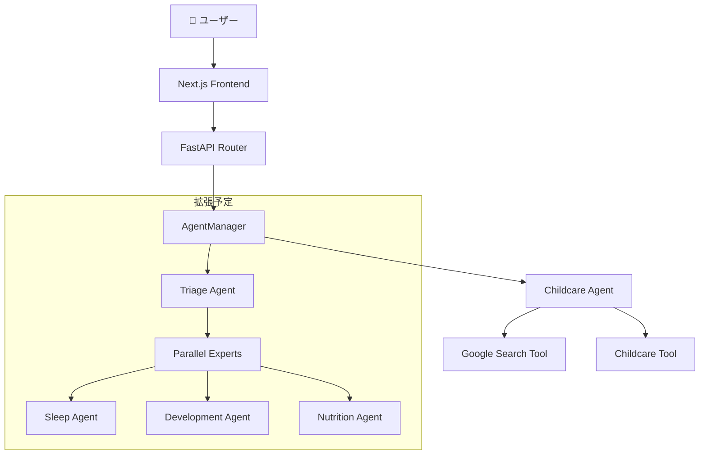

# 🧞‍♂️ GenieUs

**「見えない成長に、光をあてる。不安な毎日を、自信に変える。」**  
Google ADK × Gemini 2.5 Flash powered AI子育て支援システム

[](https://www.python.org/downloads/)
[](https://nodejs.org/)
[](https://nextjs.org/)
[](https://fastapi.tiangolo.com/)
[](https://cloud.google.com/ai-platform/docs/adk)

## ✨ 概要

GenieUsは、**Google Agent Development Kit (ADK)**とGemini 2.5 Flashを活用したADKファースト設計の子育て支援システムです。Agent中心のアーキテクチャにより、専門的で温かみのある育児サポートを24時間提供します。

### ✅ 実装完了機能（Production Ready）

#### 🤖 AI・エージェント基盤
- **ADK統合マルチエージェントシステム**: Google ADK + Gemini 2.5 Flash
- **並列エージェント調整**: 複数専門エージェントの同時実行
- **インテント認識ルーティング**: 自動的な専門エージェント振り分け
- **ストリーミングチャット**: リアルタイム応答 `/api/v1/streaming/chat`
- **対話確認システム**: ユーザー確認を伴う重要操作

#### 📊 データ管理・記録機能
- **家族管理**: 家族構成・子ども情報の管理
- **成長記録**: 身長・体重・発達マイルストーン記録
- **努力報告**: 育児努力の記録・可視化
- **食事記録**: 離乳食・食事履歴管理
- **スケジュール管理**: 予防接種・健診・イベント管理
- **思い出記録**: 写真付き育児記録
- **音声解析**: 音声入力による記録作成
- **画像解析**: 写真からの自動情報抽出

#### 🏗️ 技術基盤
- **統合DIアーキテクチャ**: Composition Root パターン
- **SQLiteデータベース**: 完全なCRUD操作
- **ファイルアップロード**: 画像・音声ファイル管理
- **RESTful API**: 20+エンドポイント実装済み
- **Next.js 15 UI**: App Router + shadcn/ui
- **認証システム**: NextAuth.js統合準備済み

### 🎯 高度な実装済み機能

- **マルチモーダル対応**: テキスト・音声・画像の統合処理
- **並列処理**: 複数タスクの同時実行・進捗表示
- **データマイグレーション**: 既存データの自動移行
- **Cloud Run対応**: 本番環境デプロイ最適化
- **段階的エラーハンドリング**: プライマリ→セカンダリ→フォールバック
- **構造化ログ**: 運用監視・デバッグ対応

## 🚀 クイックスタート

### 最速起動（推奨）

```bash
# リポジトリをクローン
git clone https://github.com/shu-nagaoka/GenieUs.git
cd GenieUs

# 開発環境を起動
./scripts/start-dev.sh
```

### Docker環境

```bash
# 開発環境
docker-compose -f docker-compose.dev.yml up -d

# 本番環境
docker-compose -f docker-compose.yml up -d
```

### 手動起動

```bash
# バックエンド
cd backend
uv sync
uv run uvicorn src.main:app --host 0.0.0.0 --port 8000 --reload

# フロントエンド（別ターミナル）
cd frontend
npm install
npm run dev
```

## 📱 アクセスポイント

起動後、以下のURLでアクセスできます：

- **🏠 アプリケーション**: http://localhost:3000
- **💬 チャット画面**: http://localhost:3000/chat
- **🔧 バックエンドAPI**: http://localhost:8000
- **📖 API仕様書**: http://localhost:8000/docs
- **🛠️ ADK Web UI**: http://localhost:8001

## 🏗️ 技術アーキテクチャ

### ADKファースト アーキテクチャ



#### 現在の実装（MVP）

1. **childcare Agent** - Gemini 2.5 Flash powered メインエージェント
   - 子育て全般の専門的相談対応
   - 年齢・発達段階推定機能
   - 安全性・緊急度評価
   - Google検索連携による最新情報提供

2. **AgentManager** - ADK Agent統一管理
   - Composition Rootパターンによる中央集約管理
   - DIコンテナ統合
   - エージェント・ツール動的組み立て

3. **準備済み拡張機能**
   - **TriageAgent**: 緊急度判定・専門分野振り分け
   - **専門エージェント群**: 睡眠・栄養・発達の並列専門相談

### 技術スタック

#### バックエンド (Python)
- **Google ADK 1.2.1** - Agent Development Kit (Gemini統合)
- **Gemini 2.5 Flash Preview** - 基盤大規模言語モデル
- **FastAPI 0.115+** - 高速非同期Webフレームワーク
- **Python 3.12+** - メイン開発言語
- **SQLite** - 軽量データベース（Cloud Run最適化）
- **Pydantic 2.0+** - データバリデーション・型安全性
- **uvicorn** - ASGI高性能サーバー
- **uv** - 高速パッケージマネージャー（Rust製）

#### フロントエンド (TypeScript)
- **Next.js 15** - React App Router フレームワーク
- **React 19** - 最新UIライブラリ
- **TypeScript 5.8+** - 型安全性・開発体験向上
- **Tailwind CSS 3.4+** - ユーティリティファーストCSS
- **shadcn/ui** - Radix UI + Tailwind統合コンポーネント
- **React Markdown** - リッチテキストレンダリング
- **NextAuth.js** - 認証システム（準備済み）
- **React Query** - サーバー状態管理（準備済み）

#### 開発・インフラ
- **Docker & Docker Compose** - コンテナ化・開発環境
- **Google Cloud Run** - サーバーレス本番環境
- **Cloud Build** - CI/CDパイプライン
- **ESLint & Prettier** - コード品質・フォーマット
- **Jest & Playwright** - 単体・E2Eテスト
- **Husky & lint-staged** - Git hooks・品質保証

## 📋 開発コマンド

### バックエンド開発

```bash
cd backend
uv sync                              # 依存関係インストール
uv run uvicorn src.main:app --reload # 開発サーバー起動
uv run pytest                       # テスト実行
uv run pytest tests/test_specific.py # 特定テスト実行
uv run ruff check                    # リンター実行
uv run ruff format                   # コードフォーマット
```

### フロントエンド開発

```bash
cd frontend
npm install                 # 依存関係インストール
npm run dev                 # 開発サーバー起動（Turbopack）
npm run build               # 本番ビルド
npm run test                # Jestテスト実行
npm run test:coverage       # カバレッジ付きテスト
npm run test:e2e            # Playwright E2Eテスト
npm run lint                # ESLint実行
npm run lint:fix            # リント問題自動修正
npm run format              # Prettierフォーマット
```

## 🏗️ プロジェクト構造

```
GenieUs/
├── backend/                           # Python バックエンド
│   ├── src/
│   │   ├── agents/                    # Google ADK エージェント
│   │   │   ├── agent_manager.py      # エージェント統一管理
│   │   │   ├── parallel_agent_coordinator.py  # 並列実行調整
│   │   │   ├── intent_based_routing_strategy.py  # 自動ルーティング
│   │   │   └── routing_executor.py   # 実行エンジン
│   │   ├── presentation/api/routes/   # FastAPI エンドポイント（20+）
│   │   │   ├── streaming_chat.py     # リアルタイムチャット
│   │   │   ├── family.py             # 家族管理
│   │   │   ├── growth_records.py     # 成長記録
│   │   │   ├── meal_records.py       # 食事記録
│   │   │   ├── effort_reports.py     # 努力報告
│   │   │   ├── schedules.py          # スケジュール
│   │   │   ├── voice_analysis.py     # 音声解析
│   │   │   ├── image_analysis.py     # 画像解析
│   │   │   └── interactive_confirmation.py  # 対話確認
│   │   ├── application/usecases/      # ビジネスロジック層
│   │   ├── infrastructure/adapters/   # 外部システム統合
│   │   ├── infrastructure/database/   # SQLiteデータベース
│   │   ├── tools/                     # ADKツール実装
│   │   ├── di_provider/               # DI統合（Composition Root）
│   │   └── main.py                   # FastAPIアプリケーション
│   └── pyproject.toml                # Python依存関係・設定
├── frontend/                          # Next.js フロントエンド
│   ├── src/
│   │   ├── app/                      # App Router（12+ページ）
│   │   │   ├── chat/                 # AIチャットページ
│   │   │   ├── dashboard/            # メインダッシュボード
│   │   │   ├── family/               # 家族管理
│   │   │   ├── records/              # 成長記録一覧
│   │   │   ├── effort-report/        # 努力報告
│   │   │   ├── meal-records/         # 食事記録
│   │   │   ├── schedule/             # スケジュール管理
│   │   │   ├── agents/               # エージェント管理
│   │   │   └── api/auth/             # NextAuth.js認証
│   │   ├── components/               # UIコンポーネント
│   │   │   ├── ui/                   # shadcn/ui プリミティブ（30+）
│   │   │   ├── features/             # 機能別コンポーネント
│   │   │   │   ├── chat/             # チャット機能
│   │   │   │   ├── family/           # 家族管理
│   │   │   │   ├── growth/           # 成長記録
│   │   │   │   ├── effort/           # 努力報告
│   │   │   │   └── meal/             # 食事管理
│   │   │   ├── layout/               # レイアウト・サイドバー
│   │   │   └── providers/            # React Contextプロバイダー
│   │   ├── hooks/                    # カスタムReactフック
│   │   ├── libs/                     # ユーティリティ・API
│   │   └── __tests__/                # Jest単体テスト
│   ├── test/e2e/                     # Playwright E2Eテスト
│   └── package.json                  # Node.js依存関係
├── scripts/                          # 開発スクリプト
│   ├── start-dev.sh                  # 開発環境起動
│   └── stop-dev.sh                   # 開発環境停止
├── docker-compose.dev.yml            # 開発用Docker Compose
├── docker-compose.yml                # 本番用Docker Compose
└── CLAUDE.md                         # 開発ガイドライン
```

## 📚 API仕様

### 主要エンドポイント

#### ストリーミングチャットAPI
```bash
# リアルタイムストリーミングチャット
POST /api/v1/streaming/chat
Content-Type: application/json

{
  "message": "2歳の夜泣きで困っています",
  "user_id": "user123",
  "session_id": "session_abc",
  "conversation_history": [
    {"sender": "user", "content": "前回の相談内容"},
    {"sender": "ai", "content": "前回のAI回答"}
  ],
  "selected_agent": "parallel_childcare"
}
```

#### レスポンス例
```json
{
  "response": "2歳の夜泣きについて、年齢と発達段階を考慮したアドバイスをお伝えします...",
  "status": "success",
  "session_id": "session_abc",
  "agent_used": "parallel_childcare",
  "routing_info": {
    "primary_agent": "childcare",
    "parallel_agents": ["sleep_specialist", "development_advisor"],
    "execution_mode": "parallel"
  },
  "follow_up_questions": [
    "睡眠環境について詳しく教えてください",
    "日中の活動パターンはいかがですか"
  ],
  "metadata": {
    "processing_time": 1.25,
    "agents_executed": 3,
    "confidence_score": 0.92
  }
}
```

#### 主要APIエンドポイント
```bash
# コアAPI
POST /api/v1/streaming/chat          # リアルタイムチャット
POST /api/v1/interactive/confirm     # 対話確認システム
GET  /api/v1/agents/info            # エージェント情報

# データ管理
GET|POST|PUT|DELETE /api/v1/family              # 家族管理
GET|POST|PUT|DELETE /api/v1/growth-records      # 成長記録
GET|POST|PUT|DELETE /api/v1/effort-reports      # 努力報告
GET|POST|PUT|DELETE /api/v1/meal-records        # 食事記録
GET|POST|PUT|DELETE /api/v1/schedules           # スケジュール
GET|POST|PUT|DELETE /api/v1/memories            # 思い出記録

# マルチメディア
POST /api/v1/file/upload             # ファイルアップロード
POST /api/v1/voice/analyze           # 音声解析
POST /api/v1/image/analyze           # 画像解析

# システム
GET  /api/v1/health                  # ヘルスチェック
GET  /docs                           # API仕様書 (Swagger)
```

詳細なAPI仕様書: http://localhost:8000/docs

## 🔧 環境設定

### 必要な環境変数

```bash
# backend/.env.dev
GOOGLE_CLOUD_PROJECT="your-project-id"
GOOGLE_CLOUD_LOCATION="us-central1"
GOOGLE_GENAI_USE_VERTEXAI="True"

# frontend/.env.local  
NEXT_PUBLIC_API_URL="http://localhost:8000"
```

### 前提ソフトウェア

- **Python 3.12+**
- **Node.js 20+**
- **uv** (Python パッケージマネージャー)
- **Docker & Docker Compose** (オプション)

## 🧪 テスト

```bash
# バックエンドテスト
cd backend && uv run pytest
cd backend && uv run pytest tests/test_specific.py  # 特定テスト

# フロントエンドテスト
cd frontend && npm run test:coverage                 # カバレッジ付き
cd frontend && npm run test:e2e                      # E2Eテスト
cd frontend && npx playwright test --ui              # UI付きE2E

# 特定ファイルテスト
npm test -- path/to/test.test.tsx
```

## 🛠️ トラブルシューティング

### よくある問題

1. **ポートが使用中**
   ```bash
   ./scripts/stop-dev.sh           # スクリプトで停止
   # または手動
   lsof -ti:3000 | xargs kill -9   # フロントエンド
   lsof -ti:8000 | xargs kill -9   # バックエンド
   ```

2. **依存関係の問題**
   ```bash
   cd backend && uv sync           # バックエンド
   cd frontend && npm install     # フロントエンド
   ```

3. **ADK関連エラー**
   - 環境変数が正しく設定されているか確認
   - Google Cloud認証情報の設定を確認

### ログ確認

```bash
# バックエンドログ
tail -f backend/backend.log

# フロントエンドログ  
tail -f frontend/frontend.log

# ADKログ
tail -f backend/adk.log
```

## 🎯 開発ハイライト

### Google ADKベストプラクティス実装

- **SequentialAgent**: 緊急度判定→専門家ルーティングの順次実行
- **ParallelAgent**: 複数視点からの並列情報収集  
- **Sub-agent パターン**: 専門エージェントの階層的組織化
- **ToolContext活用**: エージェント間での状態共有
- **Google Search統合**: 最新情報検索機能

### セキュリティ・品質管理

- 医療的内容の適切な医師相談誘導
- 年齢別安全性チェック機能
- 段階的フォールバック応答
- 構造化ログによる品質監視
- 入力検証・エラーハンドリング

## 📈 ロードマップ

### ✅ Phase 1 - 基盤システム（完了）
- [x] **ADK統合マルチエージェントシステム**: Google ADK + Gemini 2.5
- [x] **フルスタック基盤**: Next.js 15 + FastAPI
- [x] **統合DIアーキテクチャ**: Composition Root パターン
- [x] **リアルタイムチャット**: ストリーミング応答
- [x] **段階的エラーハンドリング**: 安定稼働基盤

### ✅ Phase 2 - コア機能（完了）
- [x] **マルチモーダル統合**: 音声・画像・テキスト解析
- [x] **並列エージェント**: 複数専門家の同時実行
- [x] **データ管理**: 家族・成長・食事・スケジュール記録
- [x] **SQLiteデータベース**: Cloud Run最適化
- [x] **ファイル管理**: アップロード・ダウンロード

### ✅ Phase 3 - 高度機能（完了）
- [x] **対話確認システム**: 重要操作の確認プロセス
- [x] **データマイグレーション**: 既存データ移行
- [x] **本番環境対応**: Cloud Run デプロイ最適化
- [x] **認証基盤**: NextAuth.js統合準備
- [x] **品質保証**: テスト・リント・フォーマット

### 🔄 Phase 4 - 運用・拡張（進行中）
- [ ] **Stripe決済統合**: サブスクリプション課金
- [ ] **パフォーマンス最適化**: キャッシュ・CDN
- [ ] **多言語対応**: 国際化（i18n）
- [ ] **IoTデバイス連携**: ヘルスケアデバイス
- [ ] **専門医連携**: 外部システム統合
- [ ] **AI予測分析**: 成長パターン予測


## 📄 ライセンス

[](http://creativecommons.org/licenses/by-nc-sa/4.0/)

このプロジェクトは**Creative Commons Attribution-NonCommercial-ShareAlike 4.0 International (CC BY-NC-SA 4.0)**の下で提供されています。

### 🔓 利用について

- **✅ 学習・研究目的のみ利用可能**（完全非営利限定）
- **🚫 商用利用・企業利用は完全禁止**（フリーランス・副業含む）
- **🚫 営利に結びつく一切の活動を禁止**（間接的収益も含む）
- **📋 改変版は同じライセンスで公開が必要**
- **🏷️ 原著作者表示が必要**
- **⚖️ 詳細は**: [docs/legal/cc-license-guide.md](docs/legal/cc-license-guide.md)

### 🚫 商用利用について

このプロジェクトは**厳格な非商用利用専用**です。

**禁止される利用**:
- 企業・組織での業務利用
- フリーランス・副業での利用  
- 投資・資金調達での技術証明
- 競合サービス開発の参考利用
- キャリア向上目的での利用

商用利用は**原則として許可しません**。どうしても必要な場合は高額な商用ライセンス契約が必要です。

## 🆘 サポート

- **Issues**: [GitHub Issues](https://github.com/shu-nagaoka/GenieUs/issues)
- **リポジトリ**: [GitHub Repository](https://github.com/shu-nagaoka/GenieUs)
- **開発ガイド**: [CLAUDE.md](CLAUDE.md)
- **ライセンス詳細**: [docs/legal/cc-license-guide.md](docs/legal/cc-license-guide.md)

---

**Made with ❤️ for parents and families**

*Powered by Google Agent Development Kit (ADK)*