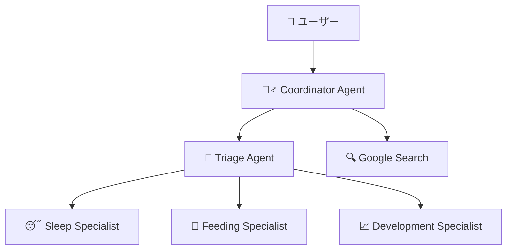

# 🧞‍♂️ GenieUs

**Google ADK活用 AI子育て支援アプリケーション - あなたの育児をサポートする魔法のGenie**

[](https://opensource.org/licenses/MIT)
[](https://www.python.org/downloads/)
[](https://nodejs.org/)
[](https://nextjs.org/)
[](https://fastapi.tiangolo.com/)

## ✨ 概要

GenieUsは、**Google Agent Development Kit (ADK)**を活用した次世代AI子育て支援アプリケーションです。高度なマルチエージェント技術により、24時間いつでも専門的な育児アドバイスを提供し、年齢に応じたパーソナライズされたサポートを実現します。

### 🎯 実装済み主要機能

- **🤖 高度なAIチャット相談**: Google ADK マルチエージェントによる専門分野別相談
  - 睡眠専門エージェント（夜泣き、寝かしつけ）
  - 授乳・食事専門エージェント（離乳食、アレルギー対応）
  - 発達専門エージェント（成長マイルストーン、言語発達）
  - 緊急度判定エージェント（医療機関受診判断）
- **💬 リアルタイムチャット**: RESTful API + WebSocket対応
- **📱 レスポンシブUI**: モバイルファースト設計、shadcn/ui使用
- **📝 会話履歴管理**: セッション保存・復元機能
- **🔄 フォローアップ質問**: AI自動生成による会話継続サポート
- **🎨 美しいデザイン**: 子育て支援に特化した温かみのあるUI

### 🚧 準備済み機能（UI実装済み）

- **📊 ダッシュボード**: 子どもの状況サマリー、今日のタスク
- **📈 成長記録トラッキング**: 授乳、睡眠、発達マイルストーンの記録
- **📝 子育て記録**: 思い出、日常、マイルストーン記録
- **📅 スケジotukatュール管理**: 予防接種、健診の管理

## 🚀 クイックスタート

### 最速起動（推奨）

```bash
# リポジトリをクローン
git clone <repository-url>
cd GenieUs

# 開発環境を起動
./scripts/start-dev.sh
```

### Docker環境

```bash
# 開発環境
docker-compose -f docker-compose.dev.yml up -d

# 本番環境
docker-compose -f docker-compose.yml up -d
```

### 手動起動

```bash
# バックエンド
cd backend
uv sync
uv run uvicorn src.main:app --host 0.0.0.0 --port 8000 --reload

# フロントエンド（別ターミナル）
cd frontend
npm install
npm run dev
```

## 📱 アクセスポイント

起動後、以下のURLでアクセスできます：

- **🏠 アプリケーション**: http://localhost:3000
- **💬 チャット画面**: http://localhost:3000/chat
- **🔧 バックエンドAPI**: http://localhost:8000
- **📖 API仕様書**: http://localhost:8000/docs
- **🛠️ ADK Web UI**: http://localhost:8001

## 🏗️ 技術アーキテクチャ

### マルチエージェント構成（Google ADK）



#### エージェント詳細

1. **CoordinatorAgent** - メイン窓口（Genieとして振る舞い）
   - ユーザー向け統合インターフェース
   - 適切な専門エージェントへのルーティング
   - 温かみのある応答生成

2. **TriageAgent** - 緊急度判定エージェント
   - 医療機関受診の必要性を自動判定
   - HIGH/MEDIUM/LOWの3段階評価
   - 安全性を最優先とした判断

3. **専門エージェント群**
   - **SleepSpecialist**: 睡眠問題の専門対応
   - **FeedingSpecialist**: 授乳・食事の専門アドバイス
   - **DevelopmentSpecialist**: 発達・成長サポート

### 技術スタック

#### バックエンド
- **Google ADK 1.0.0** - AIエージェント開発フレームワーク
- **FastAPI 0.115.12** - 高速Python Webフレームワーク
- **Python 3.12+** - メイン開発言語
- **Pydantic 2.0+** - データバリデーション・設定管理
- **uvicorn** - ASGIサーバー
- **uv** - 高速Pythonパッケージマネージャー

#### フロントエンド
- **Next.js 15.3.3** - React フルスタックフレームワーク
- **React 19.0.0** - UIライブラリ
- **TypeScript 5.8.3** - 型安全性
- **Tailwind CSS 3.4.1** - ユーティリティファーストCSS
- **shadcn/ui** - 高品質UIコンポーネントライブラリ
- **React Markdown** - Markdown レンダリング

#### 開発・インフラ
- **Docker & Docker Compose** - コンテナ化・オーケストレーション
- **ESLint & Prettier** - コード品質・フォーマット管理
- **Jest & Playwright** - テスティングフレームワーク

## 📋 開発コマンド

### バックエンド開発

```bash
cd backend
uv sync                              # 依存関係インストール
uv run uvicorn src.main:app --reload # 開発サーバー起動
uv run pytest                       # テスト実行
uv run pytest tests/test_specific.py # 特定テスト実行
uv run ruff check                    # リンター実行
uv run ruff format                   # コードフォーマット
```

### フロントエンド開発

```bash
cd frontend
npm install                 # 依存関係インストール
npm run dev                 # 開発サーバー起動（Turbopack）
npm run build               # 本番ビルド
npm run test                # Jestテスト実行
npm run test:coverage       # カバレッジ付きテスト
npm run test:e2e            # Playwright E2Eテスト
npm run lint                # ESLint実行
npm run lint:fix            # リント問題自動修正
npm run format              # Prettierフォーマット
```

## 🏗️ プロジェクト構造

```
GenieUs/
├── backend/                           # Python バックエンド
│   ├── src/
│   │   ├── agents/                    # Google ADK エージェント
│   │   │   └── childcare/
│   │   │       ├── childcare.py      # メインエージェント
│   │   │       └── router_agent.py   # マルチエージェント実装
│   │   ├── presentation/api/routes/   # FastAPI エンドポイント
│   │   │   ├── chat.py               # チャットAPI
│   │   │   ├── chat_history.py       # 履歴管理API
│   │   │   └── health.py             # ヘルスチェック
│   │   ├── application/               # ビジネスロジック層
│   │   ├── infrastructure/            # インフラストラクチャ層
│   │   └── main.py                   # FastAPIアプリケーション
│   └── pyproject.toml                # Python依存関係・設定
├── frontend/                          # Next.js フロントエンド
│   ├── src/
│   │   ├── app/                      # App Router
│   │   │   ├── chat/                 # チャットページ
│   │   │   ├── dashboard/            # ダッシュボード
│   │   │   ├── records/              # 記録ページ
│   │   │   ├── schedule/             # スケジュール
│   │   │   └── tracking/             # 成長記録
│   │   ├── components/               # UIコンポーネント
│   │   │   ├── ui/                   # shadcn/ui プリミティブ
│   │   │   ├── features/             # 機能別コンポーネント
│   │   │   └── layout/               # レイアウトコンポーネント
│   │   └── hooks/                    # カスタムReactフック
│   └── package.json                  # Node.js依存関係
├── scripts/                          # 開発スクリプト
│   ├── start-dev.sh                  # 開発環境起動
│   └── stop-dev.sh                   # 開発環境停止
├── docker-compose.dev.yml            # 開発用Docker Compose
├── docker-compose.yml                # 本番用Docker Compose
└── CLAUDE.md                         # 開発ガイドライン
```

## 📚 API仕様

### 主要エンドポイント

#### チャットAPI
```bash
# RESTful チャット
POST /api/v1/chat
Content-Type: application/json

{
  "message": "夜泣きで困っています",
  "user_id": "frontend_user",
  "session_id": "session-123",
  "conversation_history": [...]
}

# WebSocket チャット
WS /api/v1/chat/ws
```

#### その他API
- `GET /api/v1/health` - ヘルスチェック
- `GET /api/v1/debug/info` - デバッグ情報
- `POST /api/v1/chat/history` - チャット履歴管理

詳細なAPI仕様書: http://localhost:8000/docs

## 🔧 環境設定

### 必要な環境変数

```bash
# backend/.env.dev
GOOGLE_CLOUD_PROJECT="your-project-id"
GOOGLE_CLOUD_LOCATION="us-central1"
GOOGLE_GENAI_USE_VERTEXAI="True"

# frontend/.env.local  
NEXT_PUBLIC_API_URL="http://localhost:8000"
```

### 前提ソフトウェア

- **Python 3.12+**
- **Node.js 20+**
- **uv** (Python パッケージマネージャー)
- **Docker & Docker Compose** (オプション)

## 🧪 テスト

```bash
# バックエンドテスト
cd backend && uv run pytest
cd backend && uv run pytest tests/test_specific.py  # 特定テスト

# フロントエンドテスト
cd frontend && npm run test:coverage                 # カバレッジ付き
cd frontend && npm run test:e2e                      # E2Eテスト
cd frontend && npx playwright test --ui              # UI付きE2E

# 特定ファイルテスト
npm test -- path/to/test.test.tsx
```

## 🛠️ トラブルシューティング

### よくある問題

1. **ポートが使用中**
   ```bash
   ./scripts/stop-dev.sh           # スクリプトで停止
   # または手動
   lsof -ti:3000 | xargs kill -9   # フロントエンド
   lsof -ti:8000 | xargs kill -9   # バックエンド
   ```

2. **依存関係の問題**
   ```bash
   cd backend && uv sync           # バックエンド
   cd frontend && npm install     # フロントエンド
   ```

3. **ADK関連エラー**
   - 環境変数が正しく設定されているか確認
   - Google Cloud認証情報の設定を確認

### ログ確認

```bash
# バックエンドログ
tail -f backend/backend.log

# フロントエンドログ  
tail -f frontend/frontend.log

# ADKログ
tail -f backend/adk.log
```

## 🎯 開発ハイライト

### Google ADKベストプラクティス実装

- **SequentialAgent**: 緊急度判定→専門家ルーティングの順次実行
- **ParallelAgent**: 複数視点からの並列情報収集  
- **Sub-agent パターン**: 専門エージェントの階層的組織化
- **ToolContext活用**: エージェント間での状態共有
- **Google Search統合**: 最新情報検索機能

### セキュリティ・品質管理

- 医療的内容の適切な医師相談誘導
- 年齢別安全性チェック機能
- 段階的フォールバック応答
- 構造化ログによる品質監視
- 入力検証・エラーハンドリング

## 📈 ロードマップ

### Phase 1 - 基盤完成 ✅
- [x] Google ADKマルチエージェント実装
- [x] RESTful API + WebSocket
- [x] レスポンシブUI実装
- [x] 会話履歴管理
- [x] フォローアップ質問

### Phase 2 - 機能拡張 🚧  
- [ ] データベース統合（PostgreSQL/Redis）
- [ ] 認証システム完全実装
- [ ] 記録・スケジュール機能詳細実装
- [ ] Push通知・リマインダー

### Phase 3 - 高度機能 📋
- [ ] 音声入力対応
- [ ] 画像解析機能（症状写真等）
- [ ] 多言語対応
- [ ] IoTデバイス連携
- [ ] 専門医との連携機能

## 🤝 コントリビューション

1. Forkしてブランチを作成
2. 変更を実装（CLAUDE.mdの開発ガイドラインに従う）
3. テストを実行
4. Pull Requestを作成

### 開発ガイドライン

- Import文は必ずファイル先頭に配置
- ADKファーストアプローチを採用
- 型アノテーションを適切に使用
- 構造化ログを活用

## 📝 ライセンス

[MIT License](LICENSE)

## 🆘 サポート

- **Issues**: [GitHub Issues](https://github.com/your-repo/GenieUs/issues)
- **Discord**: [コミュニティ](https://discord.gg/GenieUs)
- **Email**: support@GenieUs.com

---

**Made with ❤️ for parents and families**

*Powered by Google Agent Development Kit (ADK)*