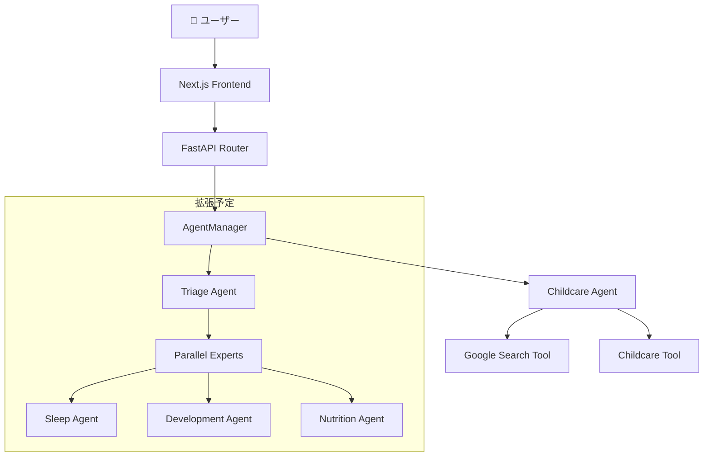

# 🧞‍♂️ GenieUs

**「見えない成長に、光をあてる。不安な毎日を、自信に変える。」**  
Google ADK × Gemini 2.5 Flash powered AI子育て支援システム

[](https://www.python.org/downloads/)
[](https://nodejs.org/)
[](https://nextjs.org/)
[](https://fastapi.tiangolo.com/)
[](https://cloud.google.com/ai-platform/docs/adk)

## ✨ 概要

GenieUsは、**Google Agent Development Kit (ADK)**とGemini 2.5 Flashを活用したADKファースト設計の子育て支援システムです。Agent中心のアーキテクチャにより、専門的で温かみのある育児サポートを24時間提供します。

### 🎯 MVP実装完了機能

- **🤖 ADK統合マルチエージェントシステム**: Gemini-powered childcareエージェント
- **💬 リアルタイムチャット相談**: `/api/v1/multiagent/chat`エンドポイント
- **📱 Next.js レスポンシブUI**: shadcn/ui + Tailwind CSS設計
- **📝 会話履歴管理**: アプリケーション側実装による文脈保持
- **🔄 段階的エラーハンドリング**: フォールバック機構付き安定稼働
- **🏗️ 統合DIアーキテクチャ**: Composition Root パターン採用
- **📊 構造化ログ**: ADKイベント詳細ログ + 運用監視対応

### 🚧 準備済み拡張機能（基盤実装済み）

- **🔧 マルチモーダルツール**: 画像解析・ファイル管理・音声解析
- **📈 トリアージ＋専門家パイプライン**: 緊急度判定→専門分野ルーティング
- **📊 ダッシュボード**: 子どもの状況サマリー、今日のタスク  
- **📝 成長記録**: 授乳、睡眠、発達マイルストーン記録
- **📅 スケジュール管理**: 予防接種、健診管理

## 🚀 クイックスタート

### 最速起動（推奨）

```bash
# リポジトリをクローン
git clone https://github.com/shu-nagaoka/GenieUs.git
cd GenieUs

# 開発環境を起動
./scripts/start-dev.sh
```

### Docker環境

```bash
# 開発環境
docker-compose -f docker-compose.dev.yml up -d

# 本番環境
docker-compose -f docker-compose.yml up -d
```

### 手動起動

```bash
# バックエンド
cd backend
uv sync
uv run uvicorn src.main:app --host 0.0.0.0 --port 8000 --reload

# フロントエンド（別ターミナル）
cd frontend
npm install
npm run dev
```

## 📱 アクセスポイント

起動後、以下のURLでアクセスできます：

- **🏠 アプリケーション**: http://localhost:3000
- **💬 チャット画面**: http://localhost:3000/chat
- **🔧 バックエンドAPI**: http://localhost:8000
- **📖 API仕様書**: http://localhost:8000/docs
- **🛠️ ADK Web UI**: http://localhost:8001

## 🏗️ 技術アーキテクチャ

### ADKファースト アーキテクチャ



#### 現在の実装（MVP）

1. **childcare Agent** - Gemini 2.5 Flash powered メインエージェント
   - 子育て全般の専門的相談対応
   - 年齢・発達段階推定機能
   - 安全性・緊急度評価
   - Google検索連携による最新情報提供

2. **AgentManager** - ADK Agent統一管理
   - Composition Rootパターンによる中央集約管理
   - DIコンテナ統合
   - エージェント・ツール動的組み立て

3. **準備済み拡張機能**
   - **TriageAgent**: 緊急度判定・専門分野振り分け
   - **専門エージェント群**: 睡眠・栄養・発達の並列専門相談

### 技術スタック

#### バックエンド
- **Google ADK 1.2.1** - Agent Development Kit
- **Gemini 2.5 Flash Preview** - 基盤大規模言語モデル
- **FastAPI 0.115.12** - 高速Python Webフレームワーク
- **Python 3.12+** - メイン開発言語
- **dependency-injector** - DIコンテナライブラリ
- **Pydantic 2.0+** - データバリデーション・設定管理
- **uvicorn** - ASGIサーバー
- **uv** - 高速Pythonパッケージマネージャー

#### フロントエンド
- **Next.js 15.3.3** - React フルスタックフレームワーク
- **React 19.0.0** - UIライブラリ
- **TypeScript 5.8.3** - 型安全性
- **Tailwind CSS 3.4.1** - ユーティリティファーストCSS
- **shadcn/ui** - 高品質UIコンポーネントライブラリ
- **React Markdown** - Markdown レンダリング

#### 開発・インフラ
- **Docker & Docker Compose** - コンテナ化・オーケストレーション
- **ESLint & Prettier** - コード品質・フォーマット管理
- **Jest & Playwright** - テスティングフレームワーク

## 📋 開発コマンド

### バックエンド開発

```bash
cd backend
uv sync                              # 依存関係インストール
uv run uvicorn src.main:app --reload # 開発サーバー起動
uv run pytest                       # テスト実行
uv run pytest tests/test_specific.py # 特定テスト実行
uv run ruff check                    # リンター実行
uv run ruff format                   # コードフォーマット
```

### フロントエンド開発

```bash
cd frontend
npm install                 # 依存関係インストール
npm run dev                 # 開発サーバー起動（Turbopack）
npm run build               # 本番ビルド
npm run test                # Jestテスト実行
npm run test:coverage       # カバレッジ付きテスト
npm run test:e2e            # Playwright E2Eテスト
npm run lint                # ESLint実行
npm run lint:fix            # リント問題自動修正
npm run format              # Prettierフォーマット
```

## 🏗️ プロジェクト構造

```
GenieUs/
├── backend/                           # Python バックエンド
│   ├── src/
│   │   ├── agents/                    # Google ADK エージェント
│   │   │   └── childcare/
│   │   │       ├── childcare.py      # メインエージェント
│   │   │       └── router_agent.py   # マルチエージェント実装
│   │   ├── presentation/api/routes/   # FastAPI エンドポイント
│   │   │   ├── chat.py               # チャットAPI
│   │   │   ├── chat_history.py       # 履歴管理API
│   │   │   └── health.py             # ヘルスチェック
│   │   ├── application/               # ビジネスロジック層
│   │   ├── infrastructure/            # インフラストラクチャ層
│   │   └── main.py                   # FastAPIアプリケーション
│   └── pyproject.toml                # Python依存関係・設定
├── frontend/                          # Next.js フロントエンド
│   ├── src/
│   │   ├── app/                      # App Router
│   │   │   ├── chat/                 # チャットページ
│   │   │   ├── dashboard/            # ダッシュボード
│   │   │   ├── records/              # 記録ページ
│   │   │   ├── schedule/             # スケジュール
│   │   │   └── tracking/             # 成長記録
│   │   ├── components/               # UIコンポーネント
│   │   │   ├── ui/                   # shadcn/ui プリミティブ
│   │   │   ├── features/             # 機能別コンポーネント
│   │   │   └── layout/               # レイアウトコンポーネント
│   │   └── hooks/                    # カスタムReactフック
│   └── package.json                  # Node.js依存関係
├── scripts/                          # 開発スクリプト
│   ├── start-dev.sh                  # 開発環境起動
│   └── stop-dev.sh                   # 開発環境停止
├── docker-compose.dev.yml            # 開発用Docker Compose
├── docker-compose.yml                # 本番用Docker Compose
└── CLAUDE.md                         # 開発ガイドライン
```

## 📚 API仕様

### 主要エンドポイント

#### マルチエージェントチャットAPI
```bash
# ADK統合マルチエージェントチャット
POST /api/v1/multiagent/chat
Content-Type: application/json

{
  "message": "2歳の夜泣きで困っています",
  "user_id": "anonymous", 
  "session_id": "default",
  "conversation_history": [
    {"sender": "user", "content": "前回の相談"},
    {"sender": "ai", "content": "前回の回答"}
  ]
}
```

#### レスポンス例
```json
{
  "response": "2歳の夜泣きについて、年齢に応じたアドバイスをお伝えします...",
  "status": "success",
  "session_id": "default",
  "agent_used": "childcare_agent",
  "routing_info": {"agent": "childcare", "direct_mode": true},
  "follow_up_questions": ["睡眠環境について", "日中の過ごし方は"]
}
```

#### その他API
- `GET /api/v1/health` - ヘルスチェック
- `GET /` - システム情報・利用可能エンドポイント一覧

詳細なAPI仕様書: http://localhost:8000/docs

## 🔧 環境設定

### 必要な環境変数

```bash
# backend/.env.dev
GOOGLE_CLOUD_PROJECT="your-project-id"
GOOGLE_CLOUD_LOCATION="us-central1"
GOOGLE_GENAI_USE_VERTEXAI="True"

# frontend/.env.local  
NEXT_PUBLIC_API_URL="http://localhost:8000"
```

### 前提ソフトウェア

- **Python 3.12+**
- **Node.js 20+**
- **uv** (Python パッケージマネージャー)
- **Docker & Docker Compose** (オプション)

## 🧪 テスト

```bash
# バックエンドテスト
cd backend && uv run pytest
cd backend && uv run pytest tests/test_specific.py  # 特定テスト

# フロントエンドテスト
cd frontend && npm run test:coverage                 # カバレッジ付き
cd frontend && npm run test:e2e                      # E2Eテスト
cd frontend && npx playwright test --ui              # UI付きE2E

# 特定ファイルテスト
npm test -- path/to/test.test.tsx
```

## 🛠️ トラブルシューティング

### よくある問題

1. **ポートが使用中**
   ```bash
   ./scripts/stop-dev.sh           # スクリプトで停止
   # または手動
   lsof -ti:3000 | xargs kill -9   # フロントエンド
   lsof -ti:8000 | xargs kill -9   # バックエンド
   ```

2. **依存関係の問題**
   ```bash
   cd backend && uv sync           # バックエンド
   cd frontend && npm install     # フロントエンド
   ```

3. **ADK関連エラー**
   - 環境変数が正しく設定されているか確認
   - Google Cloud認証情報の設定を確認

### ログ確認

```bash
# バックエンドログ
tail -f backend/backend.log

# フロントエンドログ  
tail -f frontend/frontend.log

# ADKログ
tail -f backend/adk.log
```

## 🎯 開発ハイライト

### Google ADKベストプラクティス実装

- **SequentialAgent**: 緊急度判定→専門家ルーティングの順次実行
- **ParallelAgent**: 複数視点からの並列情報収集  
- **Sub-agent パターン**: 専門エージェントの階層的組織化
- **ToolContext活用**: エージェント間での状態共有
- **Google Search統合**: 最新情報検索機能

### セキュリティ・品質管理

- 医療的内容の適切な医師相談誘導
- 年齢別安全性チェック機能
- 段階的フォールバック応答
- 構造化ログによる品質監視
- 入力検証・エラーハンドリング

## 📈 ロードマップ

### Phase 1 - MVP基盤完了 ✅
- [x] ADK統合マルチエージェントシステム実装
- [x] Gemini 2.5 Flash powered childcareエージェント
- [x] Next.js + FastAPI フルスタック構成
- [x] 統合DIアーキテクチャ（Composition Root）
- [x] 会話履歴管理・段階的エラーハンドリング
- [x] 構造化ログ・ADKイベント詳細ログ

### Phase 2 - マルチモーダル拡張 🚧  
- [ ] ツール統合（画像解析・ファイル管理・音声解析）
- [ ] トリアージ＋専門家パイプライン実装
- [ ] データベース統合（PostgreSQL/Redis）
- [ ] 認証システム完全実装

### Phase 3 - 高度機能 📋
- [ ] 予測インサイト・努力肯定システム
- [ ] IoTデバイス連携（体重計・体温計）
- [ ] 多言語対応（英語・中国語等）
- [ ] 専門医との連携機能


## 🆘 サポート

- **Issues**: [GitHub Issues](https://github.com/shu-nagaoka/GenieUs/issues)
- **リポジトリ**: [GitHub Repository](https://github.com/shu-nagaoka/GenieUs)
- **開発ガイド**: [CLAUDE.md](CLAUDE.md)

---

**Made with ❤️ for parents and families**

*Powered by Google Agent Development Kit (ADK)*