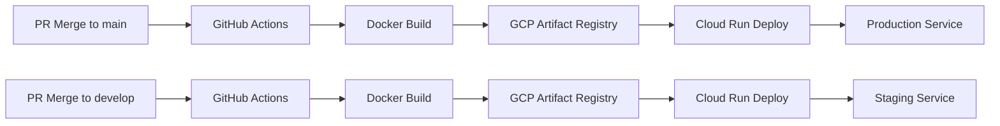

# CI/CDパイプライン - GitHub Actions & GCP Cloud Run

**mainブランチマージ → 自動デプロイ** を実現する完全自動化CI/CDパイプライン

## 🎯 概要

GenieUsのCI/CDパイプラインは、GitHub ActionsとGCP Cloud Runを使用して、mainブランチへのPRマージ時に自動的にフロントエンド・バックエンドを本番環境にデプロイします。

**対応環境**:
- **Production**: mainブランチ → Cloud Run本番サービス
- **Staging**: developブランチ → Cloud Runステージングサービス

## 🏗️ アーキテクチャ



## 🚀 クイックスタート

### 1. 環境構築（ワンコマンド）

```bash
# 統合メニューから自動セットアップ
./entrypoint.sh

# 選択肢29: GCP CI/CD環境自動構築
# 選択肢30: GitHub Secrets自動設定
# 選択肢31: CI/CDパイプライン動作テスト
```

### 2. 手動セットアップ

```bash
# Step 1: GCP環境構築
./scripts/setup-gcp-cicd.sh blog-your-project-id

# Step 2: GitHub Secrets設定
./scripts/setup-github-secrets.sh

# Step 3: 動作テスト
git push origin main
```

## 📋 必要な前提条件

### ツール要件
- [Google Cloud CLI](https://cloud.google.com/sdk/docs/install)
- [GitHub CLI](https://github.com/cli/cli)
- [Docker](https://docs.docker.com/get-docker/)

### アカウント要件
- GCPプロジェクト（blog-*推奨）
- GitHub repository（shu-nagaoka/GenieUs）
- 適切な権限設定

### 認証要件
```bash
# GCP認証
gcloud auth login
gcloud config set project YOUR_PROJECT_ID

# GitHub認証
gh auth login
```

## 🔧 詳細セットアップ手順

### Phase 1: GCP環境構築

#### 1.1 プロジェクト設定
```bash
# 既存blog-*プロジェクト確認
gcloud projects list --filter="name:blog*"

# プロジェクト選択
gcloud config set project blog-your-project-id
```

#### 1.2 API有効化
```bash
gcloud services enable run.googleapis.com
gcloud services enable cloudbuild.googleapis.com
gcloud services enable artifactregistry.googleapis.com
gcloud services enable aiplatform.googleapis.com
```

#### 1.3 サービスアカウント作成
```bash
# バックエンド用SA
gcloud iam service-accounts create genius-backend-sa \
  --display-name="Genius Backend Service Account"

# CI/CD用SA
gcloud iam service-accounts create genius-cicd-sa \
  --display-name="Genius CI/CD Service Account"
```

#### 1.4 IAM権限設定
```bash
# バックエンドSA権限
gcloud projects add-iam-policy-binding PROJECT_ID \
  --member="serviceAccount:genius-backend-sa@PROJECT_ID.iam.gserviceaccount.com" \
  --role="roles/aiplatform.user"

# CI/CD SA権限
gcloud projects add-iam-policy-binding PROJECT_ID \
  --member="serviceAccount:genius-cicd-sa@PROJECT_ID.iam.gserviceaccount.com" \
  --role="roles/run.admin"
```

### Phase 2: GitHub Secrets設定

#### 2.1 必要なSecrets
| Secret名 | 内容 | 用途 |
|----------|------|------|
| `GCP_PROJECT_ID` | GCPプロジェクトID | Cloud Runデプロイ先 |
| `GCP_SA_KEY` | CI/CD用サービスアカウントキー | GCP認証 |
| `NEXTAUTH_SECRET` | NextAuth.js用ランダム文字列 | セッション暗号化 |
| `GOOGLE_CLIENT_ID` | Google OAuth2クライアントID | 認証機能 |
| `GOOGLE_CLIENT_SECRET` | Google OAuth2クライアントシークレット | 認証機能 |

#### 2.2 自動設定コマンド
```bash
# GitHub CLI経由での自動設定
./scripts/setup-github-secrets.sh
```

#### 2.3 手動設定（GUI）
1. GitHub Repository → Settings
2. Secrets and variables → Actions
3. New repository secret で各項目を追加

### Phase 3: ワークフロー確認

#### 3.1 ワークフローファイル
- **ファイル**: `.github/workflows/deploy-cloud-run.yml`
- **トリガー**: main/developブランチへのpush
- **処理**: Docker build → Artifact Registry → Cloud Run deploy

#### 3.2 デプロイメント戦略
```yaml
environments:
  production:
    branch: main
    service: genius-*-production
  staging:
    branch: develop  
    service: genius-*-staging
```

## 🔍 トラブルシューティング

### よくある問題と解決方法

#### 🚨 認証エラー
```bash
# Error: gcloud authentication required
# 解決方法:
gcloud auth login
gcloud auth application-default login
```

#### 🚨 権限エラー
```bash
# Error: Cloud Run Admin API has not been used
# 解決方法:
gcloud services enable run.googleapis.com
```

#### 🚨 GitHub Secrets設定エラー
```bash
# Error: gh auth required
# 解決方法:
gh auth login --scopes repo,workflow
```

#### 🚨 Docker build失敗
```bash
# 原因: Dockerfileパス間違い
# 確認:
ls -la frontend/Dockerfile
ls -la backend/Dockerfile
```

### デバッグ方法

#### GitHub Actions ログ確認
```bash
# 最新のワークフロー実行確認
gh run list --repo shu-nagaoka/GenieUs

# 特定のRunの詳細ログ
gh run view [RUN_ID] --repo shu-nagaoka/GenieUs
```

#### Cloud Run ログ確認
```bash
# サービスログ確認
gcloud logs read --service=genius-backend-production --limit=50
gcloud logs read --service=genius-frontend-production --limit=50
```

#### ローカルテスト
```bash
# Docker build テスト
cd frontend && docker build -t test-frontend .
cd backend && docker build -t test-backend .

# ローカル実行テスト
docker run -p 3000:3000 test-frontend
docker run -p 8000:8000 test-backend
```

## 📊 モニタリング & 運用

### サービス状態確認
```bash
# Cloud Runサービス一覧
gcloud run services list --region=asia-northeast1

# 特定サービスの詳細
gcloud run services describe genius-backend-production \
  --region=asia-northeast1 --format=export
```

### パフォーマンス確認
```bash
# メトリクス確認
gcloud monitoring metrics list --filter="resource.type=cloud_run_revision"

# アクセスログ確認
gcloud logs read "resource.type=cloud_run_revision" --limit=10
```

### 費用監視
```bash
# 今月の請求額確認
gcloud billing budgets list

# Cloud Run費用確認
gcloud logging read "resource.type=cloud_run_revision" \
  --format="csv(timestamp,resource.labels.service_name)"
```

## 🔄 デプロイメント手順

### 通常のデプロイ
```bash
# 1. 機能ブランチで開発
git checkout -b feature/new-feature
# 開発作業...

# 2. PRを作成してレビュー
git push origin feature/new-feature
gh pr create --title "Add new feature" --body "機能説明"

# 3. mainにマージ（自動デプロイ発火）
gh pr merge --merge
```

### 緊急デプロイ
```bash
# hotfixブランチから直接マージ
git checkout -b hotfix/critical-fix
# 緊急修正...
git push origin hotfix/critical-fix
gh pr create --title "Critical Fix" --body "緊急修正"
gh pr merge --merge  # 自動デプロイ実行
```

### ロールバック
```bash
# 前のリビジョンに戻す
gcloud run services update-traffic genius-backend-production \
  --to-revisions=PREVIOUS_REVISION=100 \
  --region=asia-northeast1
```

## 🔐 セキュリティ要件

### Secrets管理
- ローカルにサービスアカウントキーを保存しない
- GitHub Secrets の定期ローテーション
- .gitignore でキーファイル除外

### アクセス制御
- 最小権限の原則でサービスアカウント設定
- Cloud Run サービスのunauthenticated呼び出し制限検討
- VPC設定によるネットワーク分離

### 監査
```bash
# IAM監査
gcloud projects get-iam-policy PROJECT_ID

# サービスアカウントキー確認
gcloud iam service-accounts keys list \
  --iam-account=genius-cicd-sa@PROJECT_ID.iam.gserviceaccount.com
```

## 📚 関連リソース

### 設定ファイル
- [`.github/workflows/deploy-cloud-run.yml`](../../.github/workflows/deploy-cloud-run.yml) - GitHub Actions ワークフロー
- [`cloudbuild.yaml`](../../cloudbuild.yaml) - Cloud Build 設定
- [`frontend/Dockerfile`](../../frontend/Dockerfile) - フロントエンド コンテナ設定
- [`backend/Dockerfile`](../../backend/Dockerfile) - バックエンド コンテナ設定

### スクリプト
- [`scripts/setup-gcp-cicd.sh`](../../scripts/setup-gcp-cicd.sh) - GCP環境自動構築
- [`scripts/setup-github-secrets.sh`](../../scripts/setup-github-secrets.sh) - GitHub Secrets自動設定
- [`entrypoint.sh`](../../entrypoint.sh) - 統合メニュー

### ドキュメント
- [クイックスタート](../development/quick-start.md) - 開発環境構築
- [アーキテクチャ概要](../architecture/overview.md) - 全体設計
- [コーディング規約](../development/coding-standards.md) - 開発規約

## 🆘 サポート

### 問題報告
問題が発生した場合は、以下の情報を含めて報告してください:

1. **エラーメッセージ**: 完全なエラーログ
2. **再現手順**: 問題が発生するまでの操作
3. **環境情報**: GCPプロジェクトID、ブランチ名
4. **ログ**: GitHub Actions ログ、Cloud Run ログ

### 緊急時連絡
- **緊急時**: まずロールバックを実行
- **障害時**: Cloud Run コンソールで手動復旧
- **データ損失時**: バックアップからの復元

---

**更新日**: 2025-06-28  
**担当者**: GenieUs開発チーム  
**Issue**: [INFRA-001](../issue/github-actions-cloud-run-cicd-setup.md)